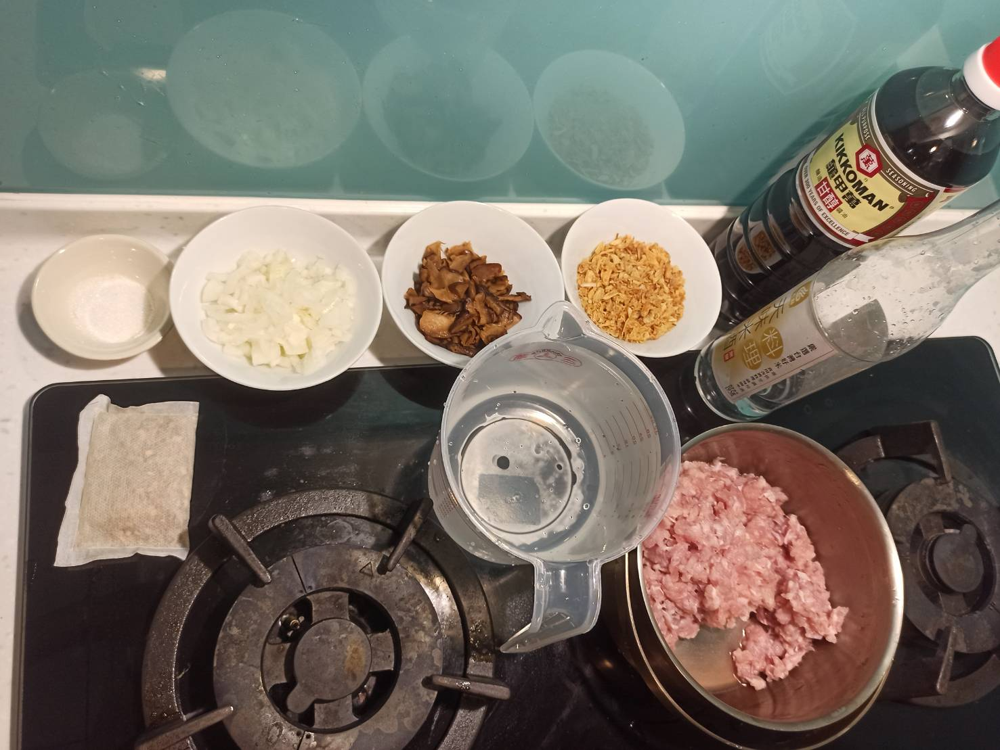
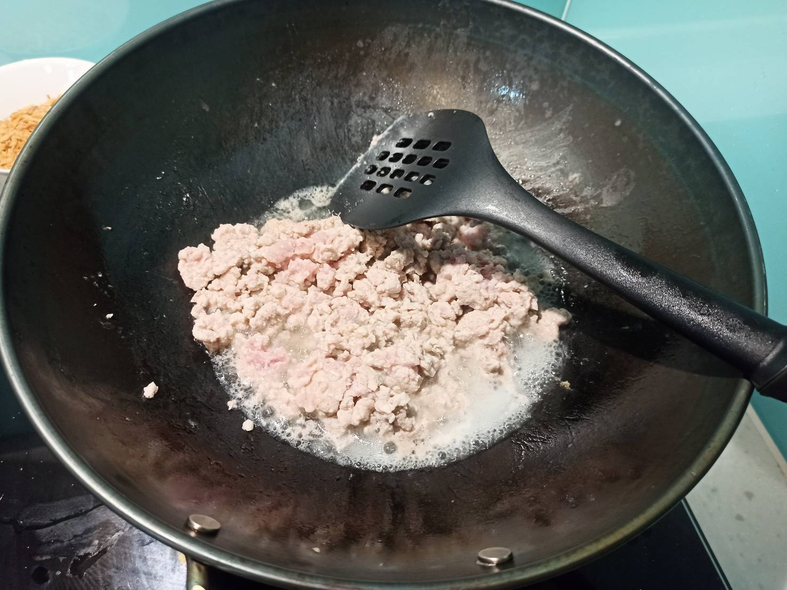
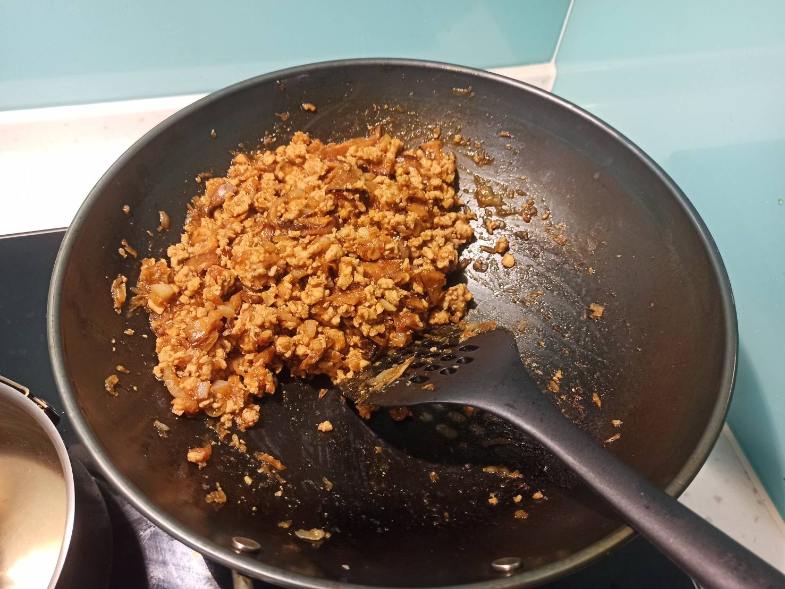

# 滷肉燥
---

+ ## 20210619
  + ### 材料
    1. 豬繳肉 400g
    2. 泡好的香菇 隨意
    3. 糖 隨意
    4. 醬油 隨意
    5. 洋蔥 半顆
    6. 紅蔥頭 隨意
    7. 米酒 隨意
    8. 水 900cc
    9. 植物油 1湯匙
    10. 滷包 1包
  + ### 作法
    1. 熱鍋，植物油下鍋
    2. 豬絞肉下鍋炒變色
    3. 材料2、5、6下鍋拌炒
    4. 米酒下去，燉煮幾下
    5. 材料3、4丟下去
    6. 滷包放到另外的鍋子倒入水
    7. 炒完的東西丟進有滷包跟水的鍋子
    8. 丟進電鍋外鍋兩杯水
  + ### 過程與成品
    
    
    
  + ### 檢討
    1. 水加太多了，味道太淡，下次至少減半
    2. 拌炒可能火要再大點炒香
    3. 忘了加蒜頭
  + ### 參考資料
    [參考網址](https://youtu.be/RsMHNGZrd-s)
