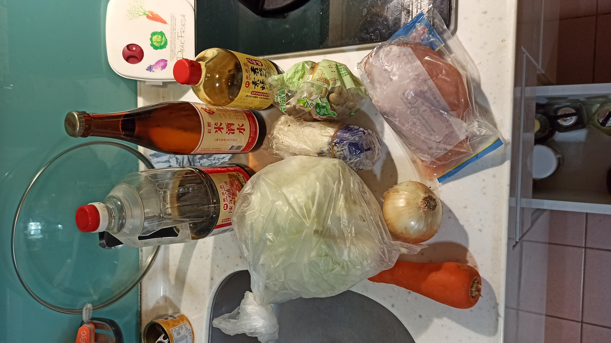
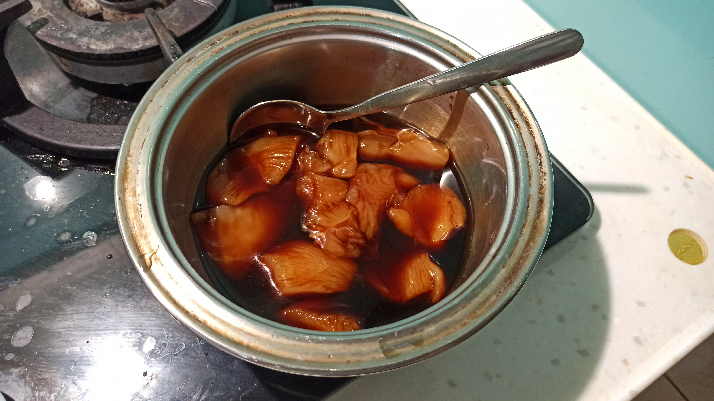
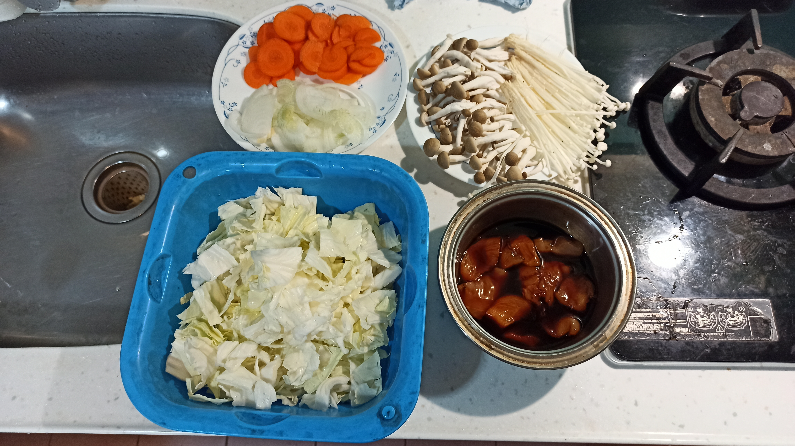
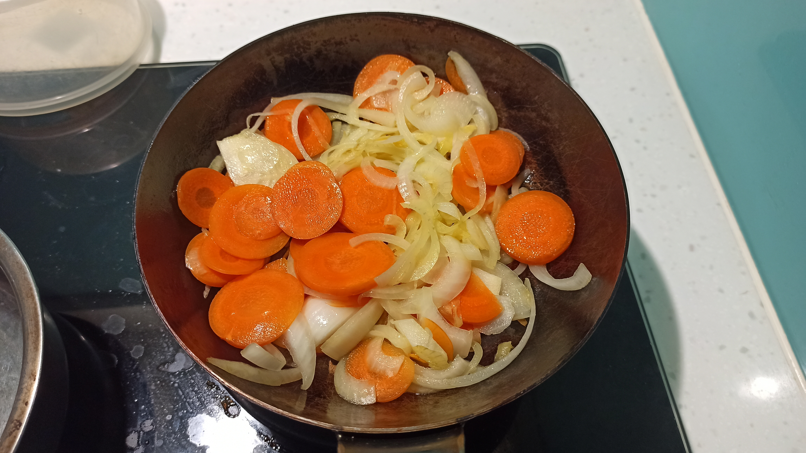
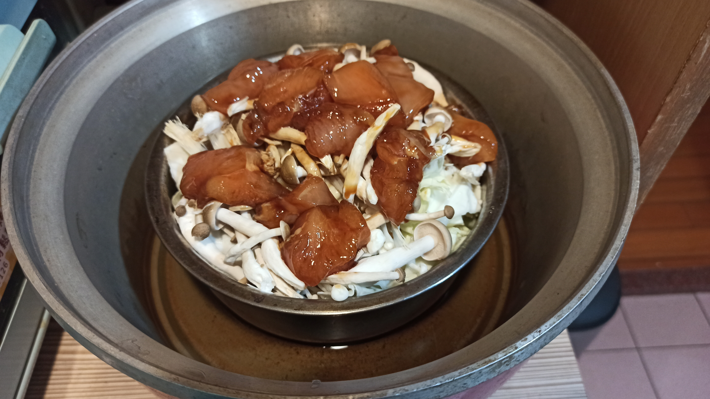

# 無水蔬菜燉雞
---
+ ## 組成
  1. 高麗菜
  2. 雞胸肉

+ ## 20240423
  + ### 材料
    1. 紅蘿蔔 適量
    2. 洋蔥 半顆
    3. 菇類 適量
    4. 高麗菜 適量
    5. 雞胸肉 適量
    6. 陳年醬油 1湯匙
    7. 素蠔油 2湯匙
    8. 米酒 3湯匙
  
  + ### 作法
    1. 將醬油、蠔油、米酒混一起去醃製雞胸肉，準備其餘備料
    2. 鍋燒熱下冷油，紅蘿蔔跟洋蔥丟下炒暖
    3. 炒完到入另一個鍋內，依序鋪上，高麗菜、菇類、雞胸肉、醬汁
    4. 再額外放入一湯匙的米酒洗炒鍋
    5. 外鍋2杯水下去蒸
  
  + ### 過程與成品
    
    
    
    
    
    
  
  + ### 檢討
    1. 感覺陳年醬油1湯匙太多了，下次半湯匙就好
    2. 紅蘿蔔因為我切沒很薄，所以可能要先丟下去炒，炒到一個時間再丟洋蔥就好，不然洋蔥軟了，紅蘿蔔還沒軟
  
  + ### 參考資料
    [滑嫩可口汤汁鲜美的无水蔬菜炖鸡！](https://www.bilibili.com/video/BV1Jc411d77E?vd_source=f69cc050298ba6cb51d08f4cefa25fe2)