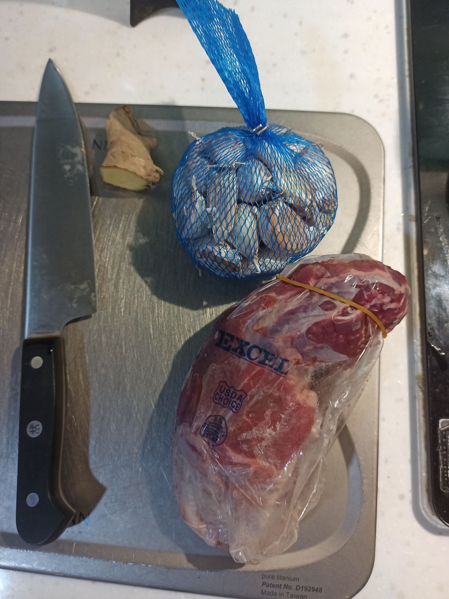
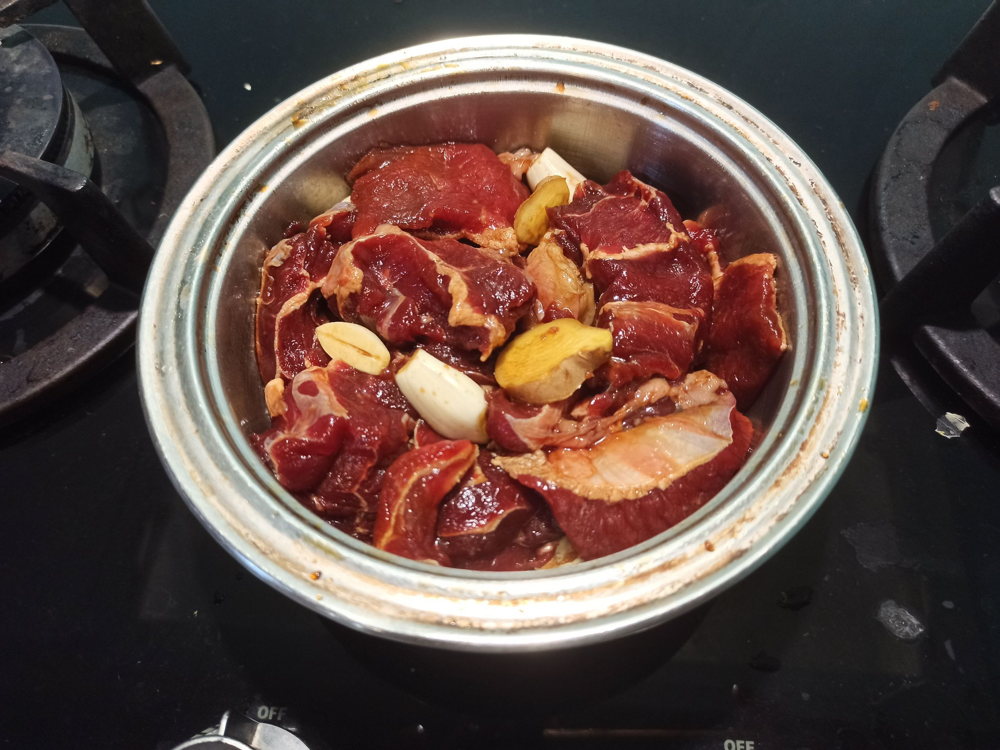
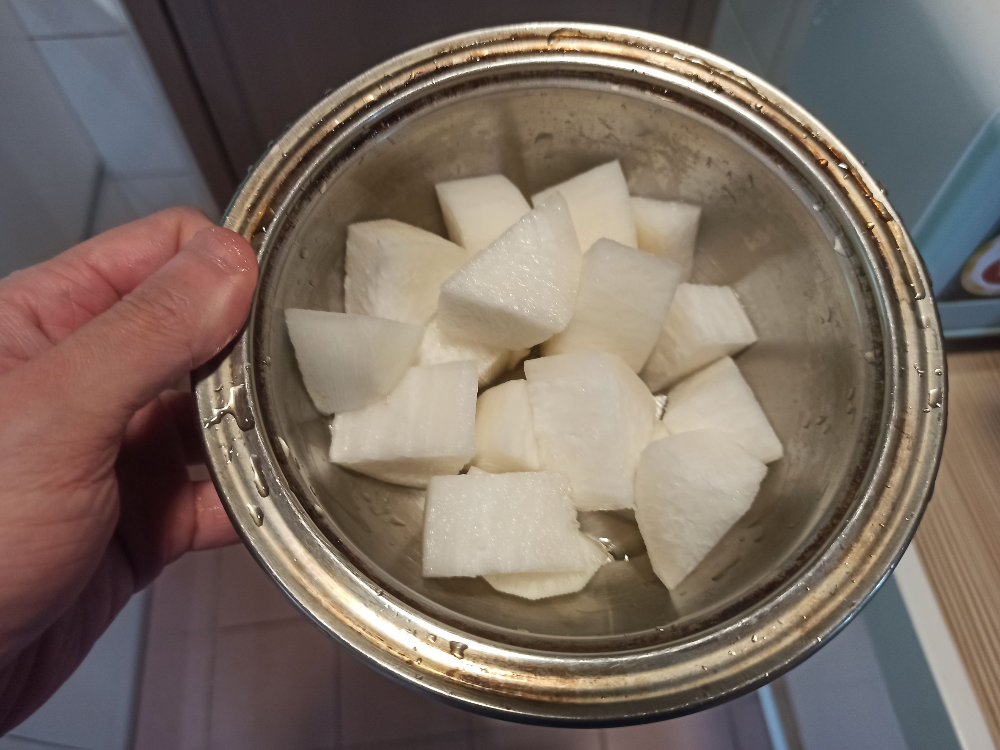
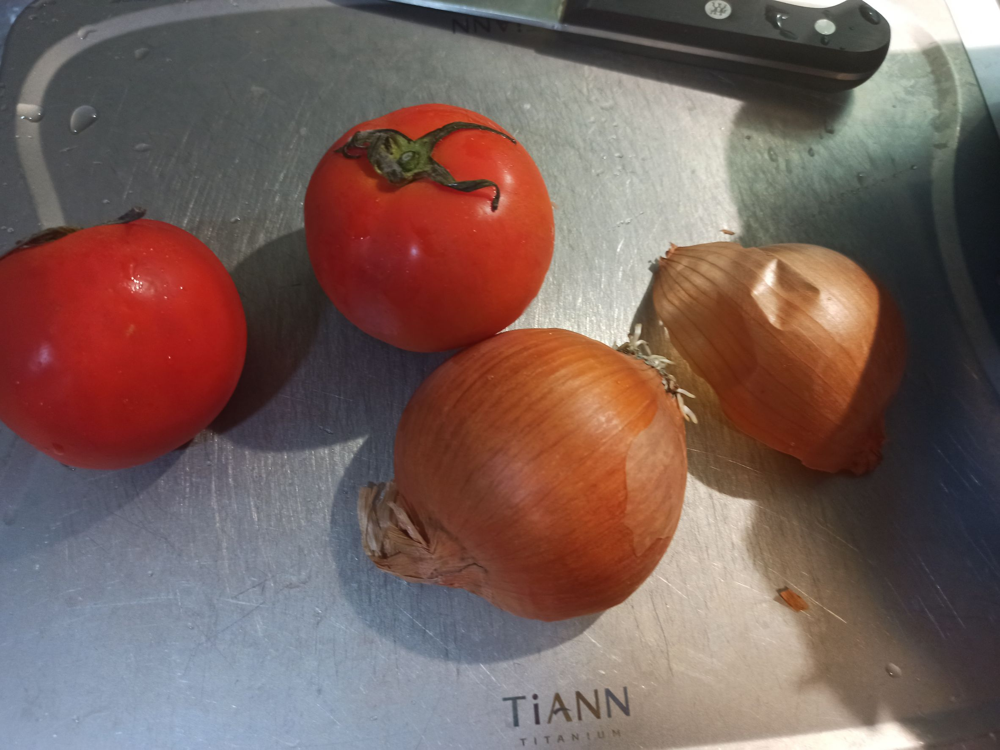
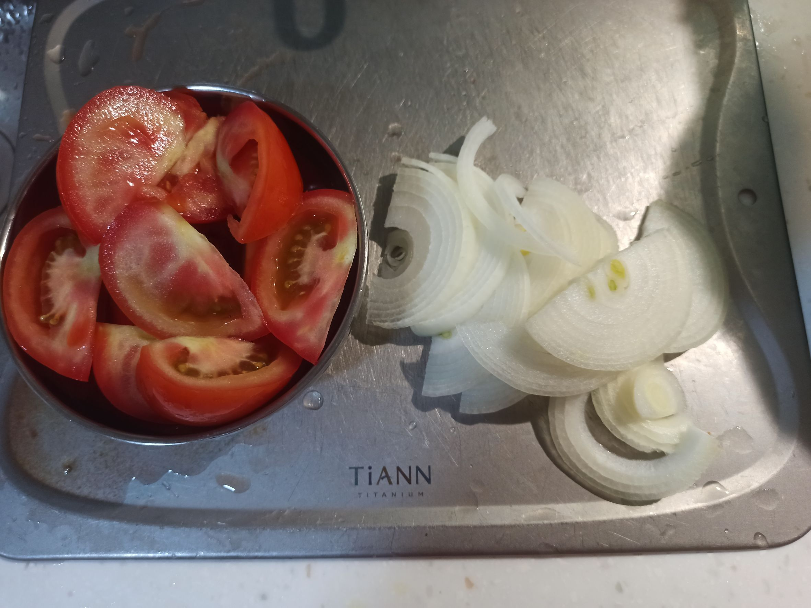
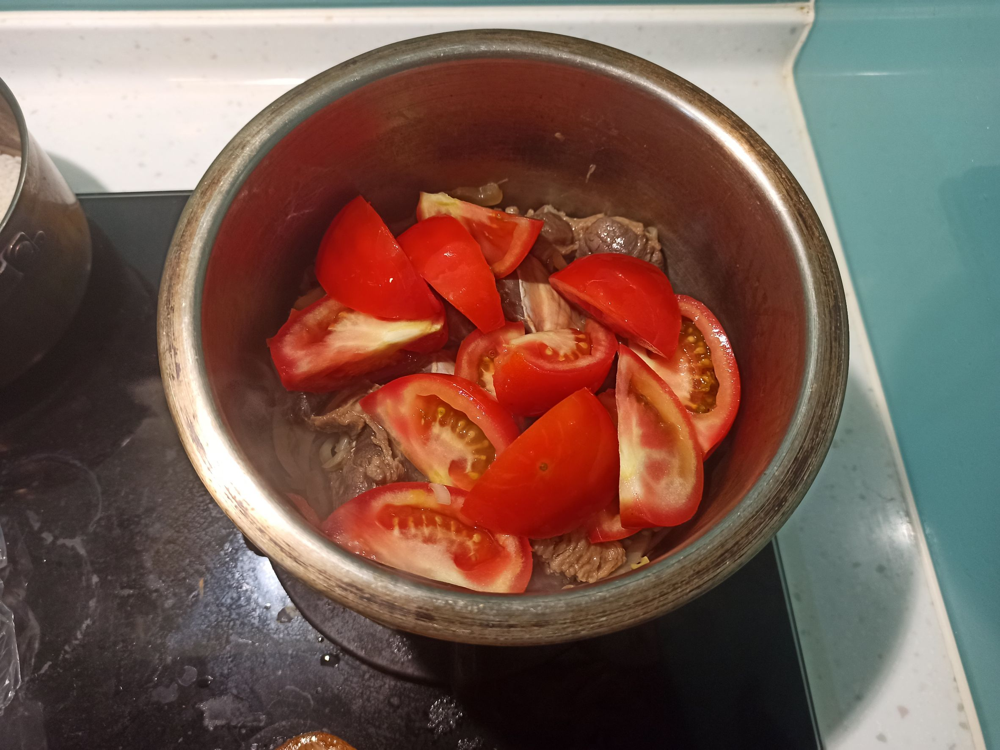
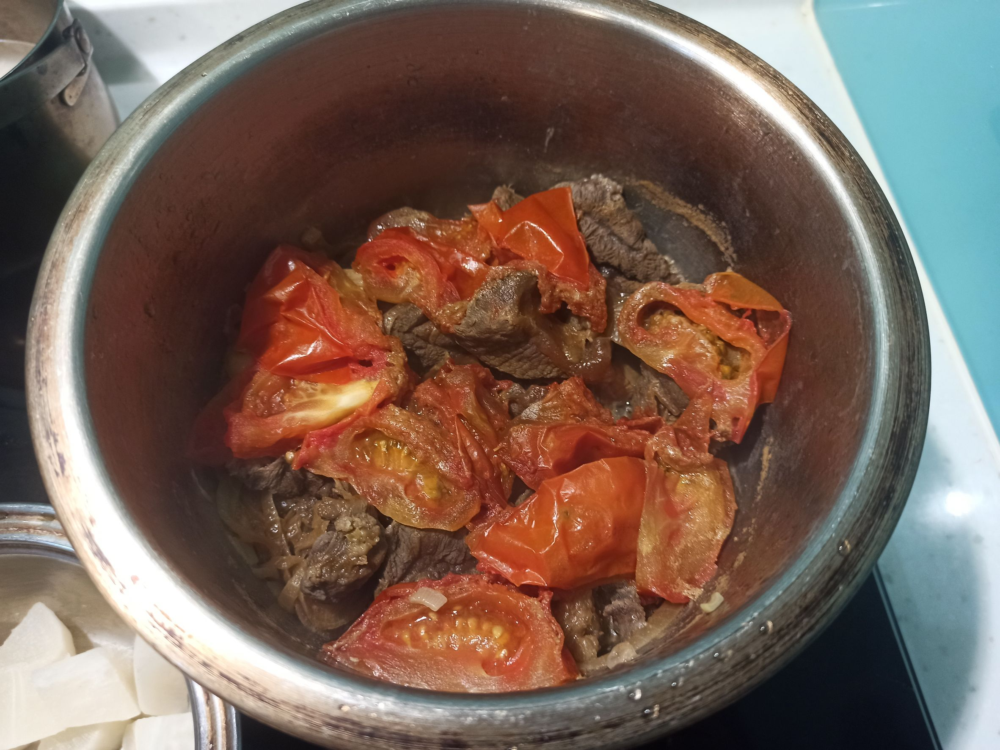
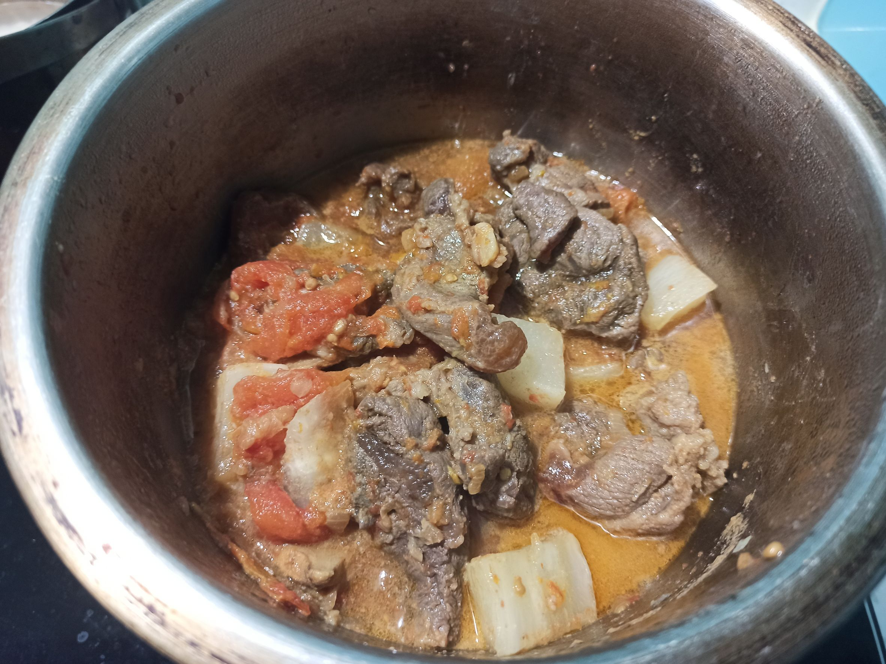
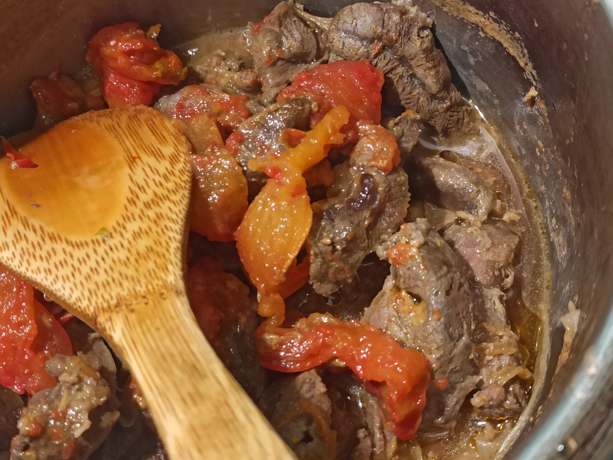

# 無水蘿蔔牛腩煲
---
+ ## 組成
  1. 牛肉
  2. 蘿蔔
  3. 番茄
  4. 洋蔥

+ ## 20230405
  + ### 材料
    1. 牛腱心切塊 477.5g
    2. 海鹽  3.8g
    3. 醬油 30g
    4. 薑片 適量
    5. 大蒜 適量
    6. 蘿蔔切塊 半顆
    7. 洋蔥切絲 半顆
    8. 番茄切塊 兩顆
  
  + ### 作法
    1. 提前一晚醃牛肉，牛肉+鹽+醬油+薑片+大蒜一起醃製
    2. 包上鋁箔紙送入冰箱一個晚上
    3. 鍋內下油，放洋蔥，中小火炒
    4. 再丟入醃製後的牛肉拌炒
    5. 待牛肉全部變色後，丟入番茄，蓋上蓋，轉小火
    6. 將蘿蔔丟入電鍋，外鍋放兩杯水蒸
    7. 燉煮45分後，將蒸好的蘿蔔丟入再燉煮個5分即可
  
  + ### 過程與成品
    
    
    
    
    
    
    
    
    
  
  + ### 檢討
    1. 這比例剛好，第一次就成功，蠻驚訝的
  
  + ### 參考資料
    [家傳蘿蔔牛腩煲](https://youtu.be/gOtCBFr8DTI)