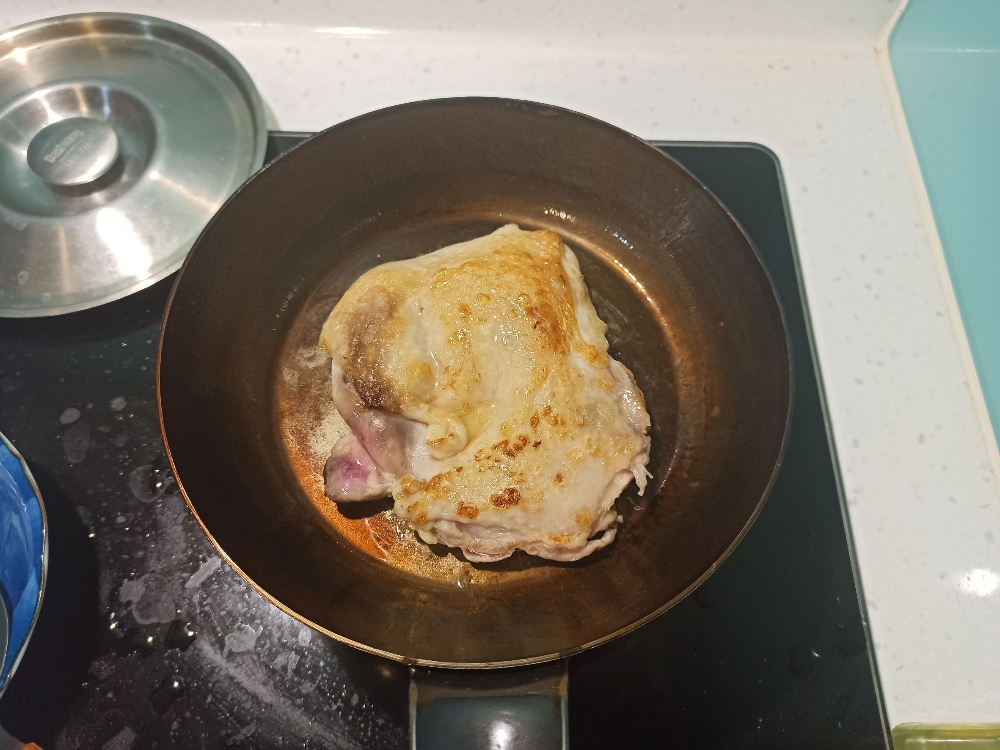
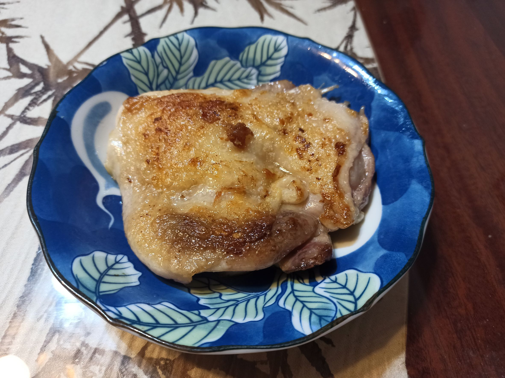
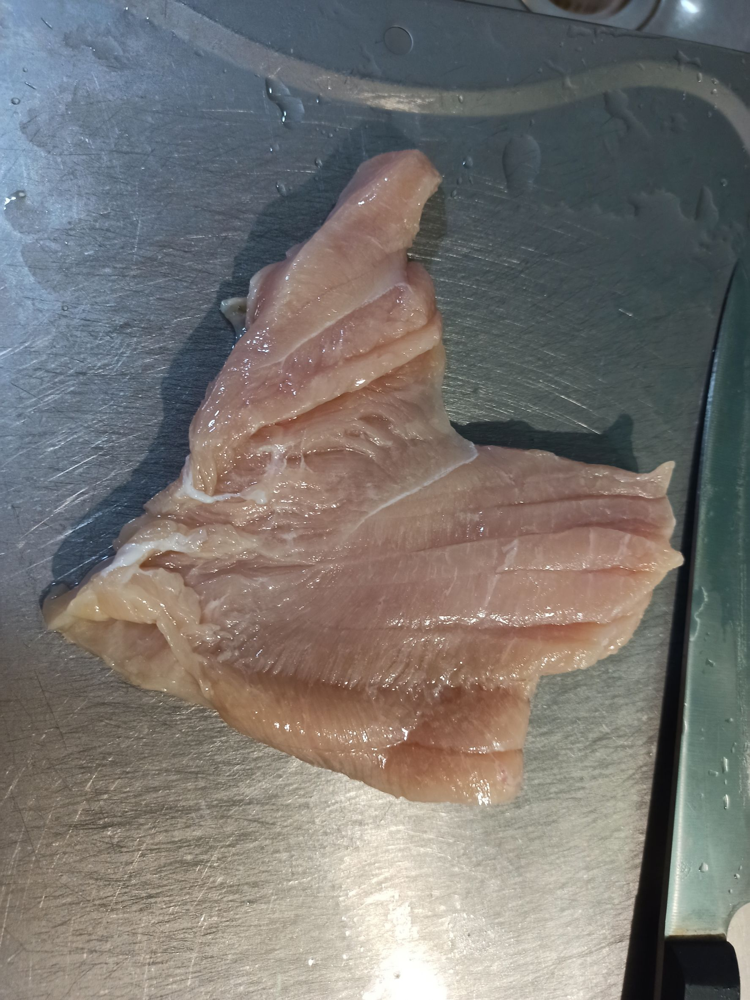
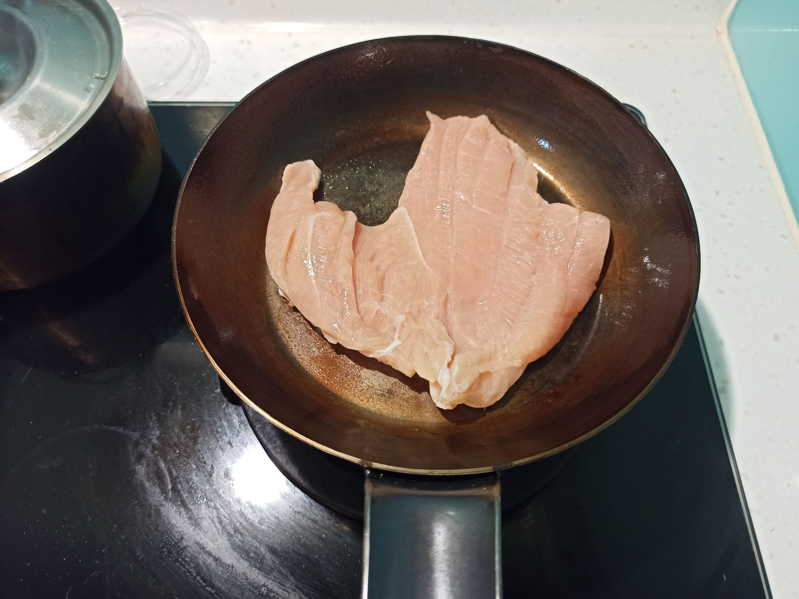
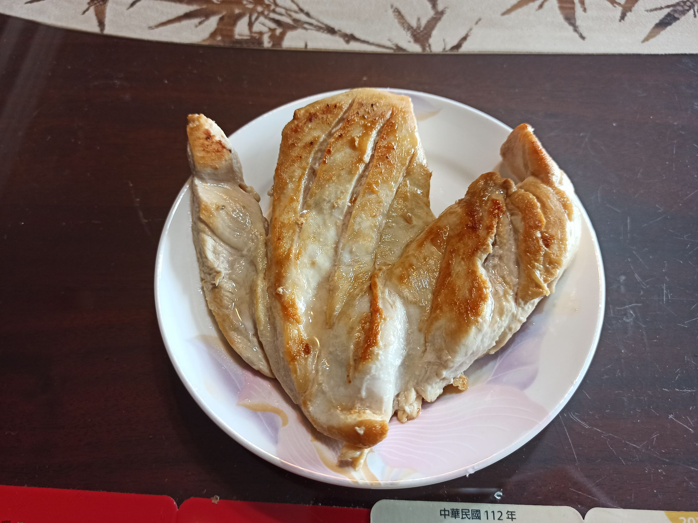

# 煎雞胸_雞腿
---
+ ## 組成
  1. 雞胸或雞腿排

+ ## 20230611
  + ### 材料
    1. 雞腿排 一塊
    2. 鹽  適量
  
  + ### 作法
    1. 平底熱鍋，下點油，用廚房紙巾將油抹鍋子抹均勻
    2. 熱了以後，中小火，雞腿排放下去
    3. 每煎一分鐘翻一次面，總共煎6分鐘左右
    4. 最後兩分鐘撒鹽，兩面都會灑到
  
  + ### 過程與成品
    
    
  
  + ### 檢討
    1. 基本上跟煎雞胸肉是一樣的方法，只是通常我拿到的雞胸肉都不太需要改刀，直接煎就好
    2. 由於雞腿肉有皮需要煎比較久，所以比雞胸肉還多煎了2分鐘，也就是多翻了兩次面
  
  + ### 參考資料
    [如何做出极致脆皮、水润爆汁的煎鸡腿](https://www.bilibili.com/video/BV1Vc411T7dk?t=16.0)

+ ## 20230610
  + ### 材料
    1. 雞胸 一塊
    2. 鹽  適量
  
  + ### 作法
    1. 先將雞胸肉改刀，盡量改成均勻的平
    2. 適當劃幾刀(可不劃)
    3. 平底熱鍋，下點油，用廚房紙巾將油抹鍋子抹均勻
    4. 熱了以後，中小火，雞胸肉放下去
    5. 每煎一分鐘翻一次面，總共煎4分鐘左右
    6. 最後兩分鐘撒鹽，兩面都會灑到
  
  + ### 過程與成品
    
    
    
  
  + ### 檢討
    1. 其實雞胸煎很多次了，後來買了小的弗萊板，很好用，用油量不用很多，中小火全程4分鐘煎就好，我個人喜歡每分鐘翻一次面，參考影片是2分鐘翻一次，總共也只翻一次面，但我的這樣顏色會太深
  
  + ### 參考資料
    [如何煎出皮脆、肉嫩的爆汁鸡胸肉](https://www.bilibili.com/video/BV1nM41157to?t=3.6)