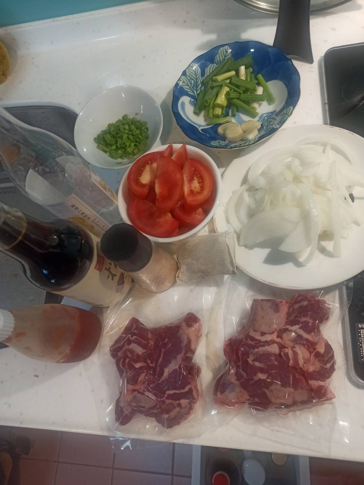
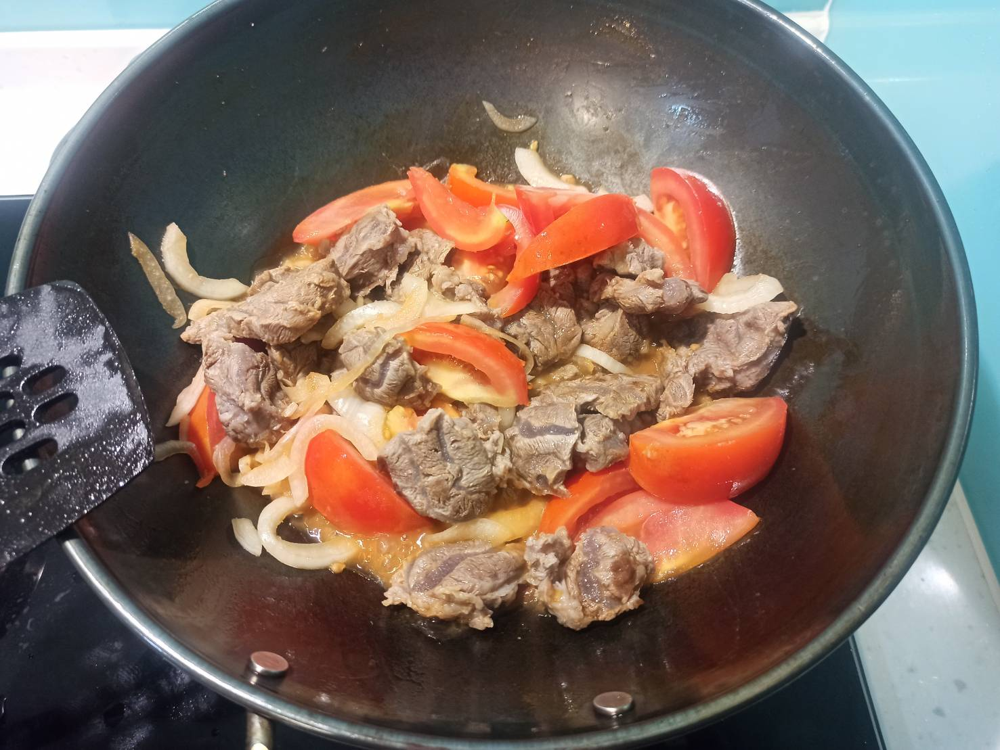
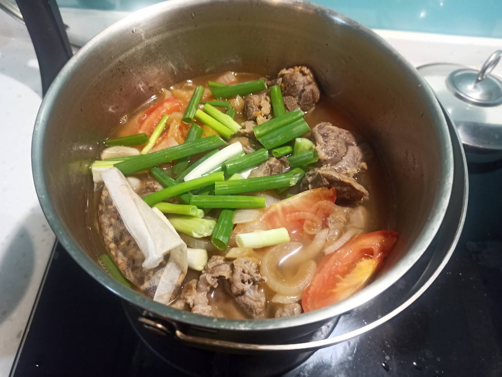

# 番茄燉牛肉
---
+ ## 組成
  1. 番茄
  2. 牛腱肉

+ ## 20210828
  + ### 材料
    1. 番茄 2顆
    2. 牛腱肉   500g
    3. 洋蔥 半顆
    4. 青蔥 2根
    5. 番茄醬   適量
    6. 米酒 3杯蓋
    7. 醬油 20g
    8. 滷包 1包
    9. 鹽   1g
    10. 糖  3g
    11. 薑片 數片
  
  + ### 作法
    1. 牛肉丟入冷水開煮，煮到有浮沫關火，過濾洗淨
    2. 炒鍋加油，丟入牛肉炒幾下，丟入洋蔥與番茄醬拌炒
    3. 丟入米酒、醬油、番茄、糖拌炒
    4. 炒完後丟入燉鍋，放入滷包、薑片、青蔥，再倒入淹過食材的水
    5. 煮滾後轉小火慢燉至少1小時
  
  + ### 過程與成品
    
    
    
  
  + ### 檢討
    1. 其實蠻成功的，下次湯加更多點就是
  
  + ### 參考資料
    [參考影片](https://youtu.be/hp3hCRRvZ-c)