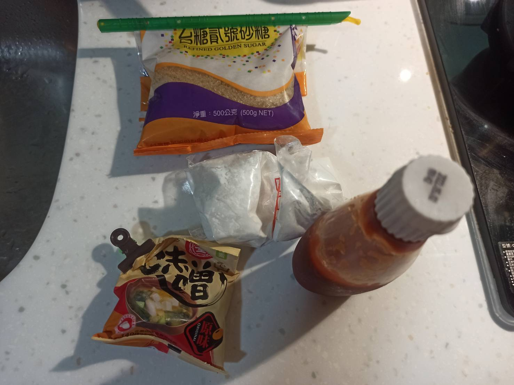
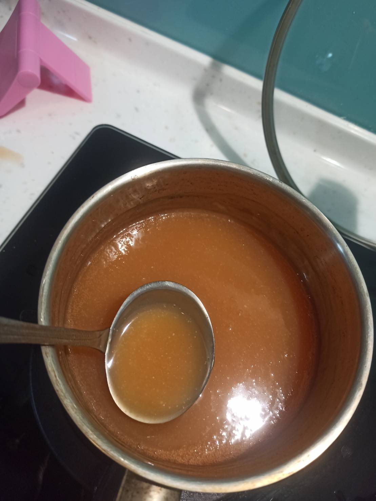
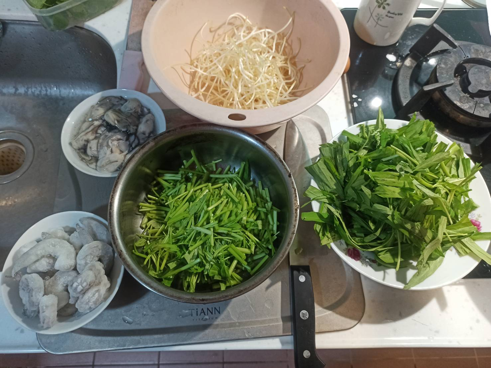
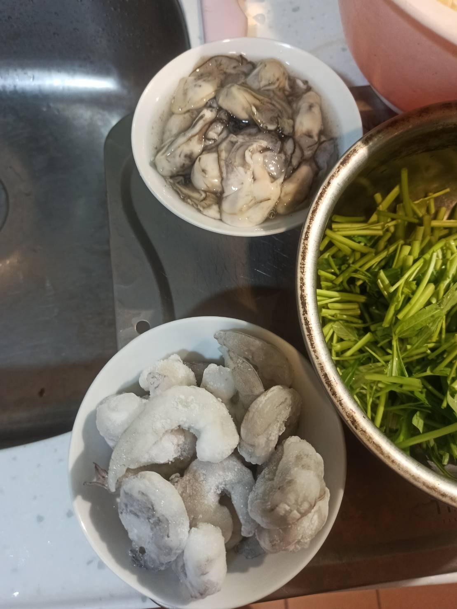
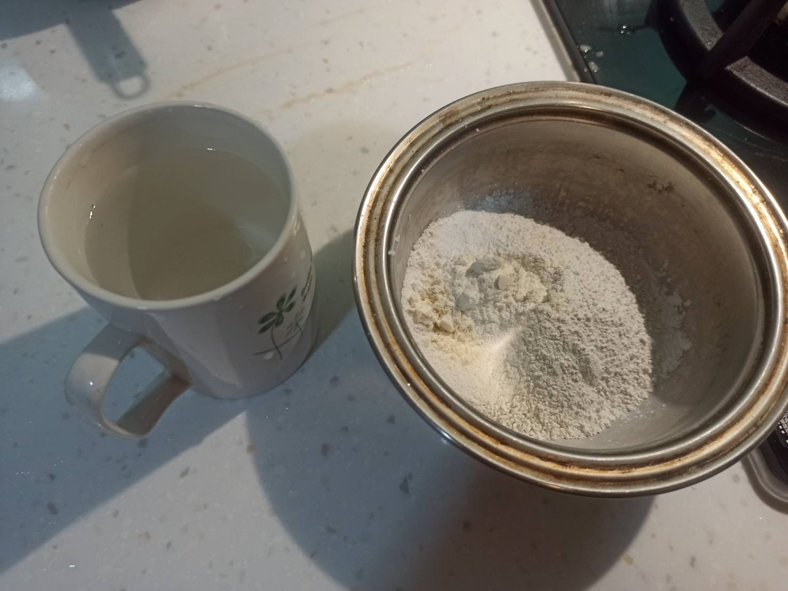
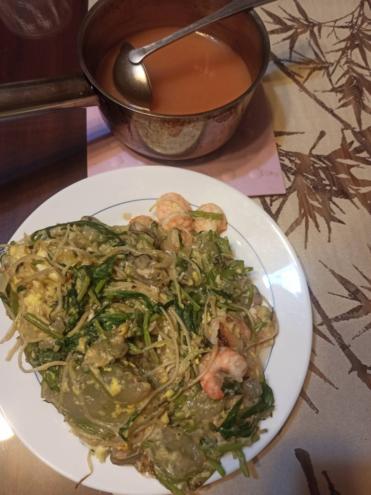

# 蚵仔煎
---
+ ## 組成
  1. 蚵仔
  2. 粉漿
  3. 醬汁

+ ## 20210717
  + ### 材料
    1. 番茄醬   1.5大匙
    2. 味噌 1大匙
    3. 砂糖 1大匙
    4. 太白粉   10g(勾芡醬汁)+40g(粉漿)
    5. 清水 300g(醬汁)+260g(粉漿)
    6. 地瓜粉   50g
    7. 中筋麵粉 10g
    8. 蚵仔     數顆
    9. 豆芽     隨意
    10. 青菜    隨意
    11. 雞蛋    數顆
  
  + ### 作法
    1. 製作醬汁
    2. 番茄醬+味噌+砂糖+清水拿去煮
    3. 接著用太白粉加少許清水勾芡丟進去
    4. 製作粉漿
    5. 地瓜粉+太白粉+麵粉+水攪拌均勻
    6. 開始煮
    7. 丟入蚵仔+蝦仁丟入粉漿
    8. 打入雞蛋
    9. 放上青菜
    10. 翻面
  
  + ### 過程與成品
    
    
    
    
    
    
  
  + ### 檢討
    1. 失敗作品，丟入的粉漿太少，加的料太多，導致難以翻面，下次粉漿加多點，料加少一點
  
  + ### 參考資料
    [台灣夜市小吃蚵仔煎](https://youtu.be/HPHy2pfTVbY)