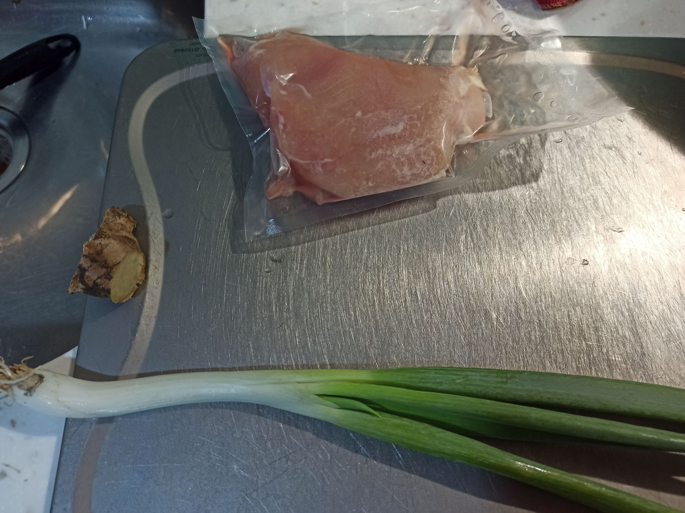
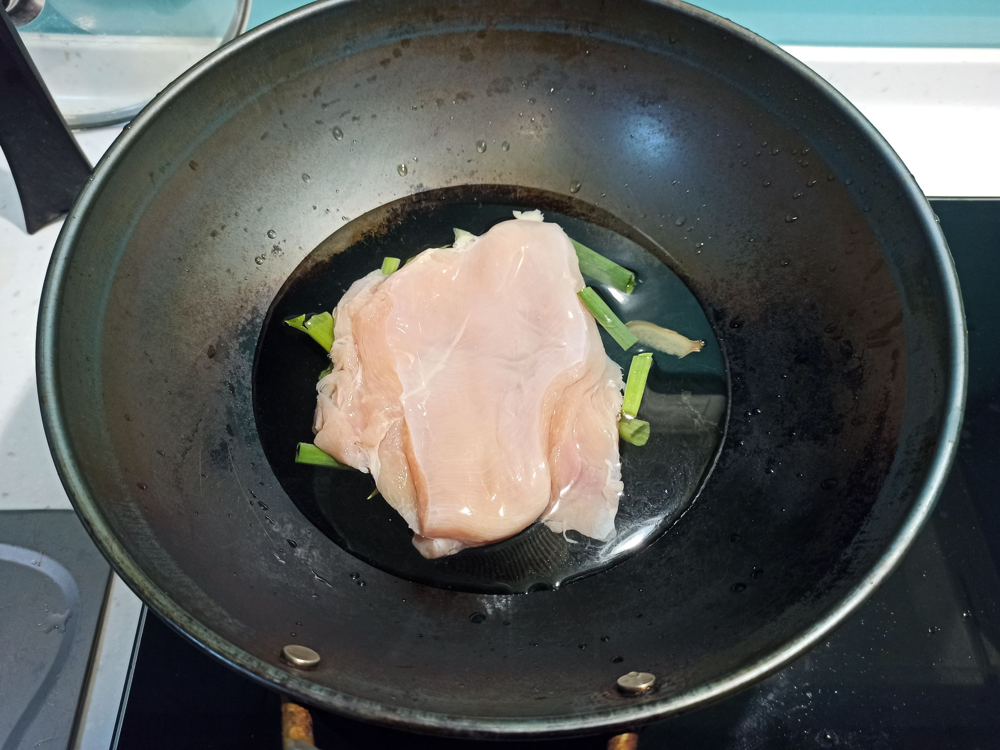
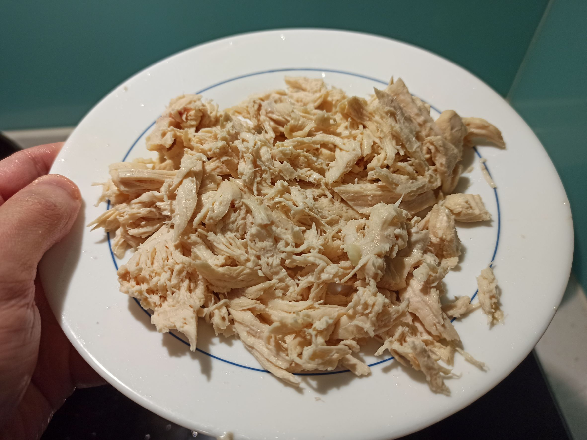
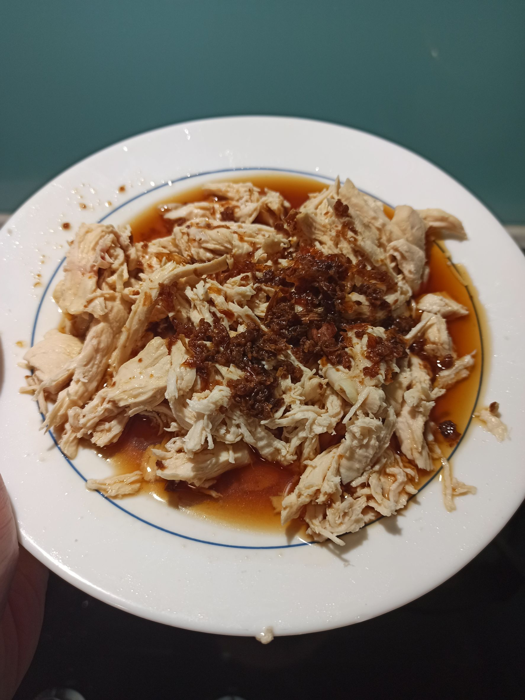

# 雞絲
---
+ ## 組成
  1. 雞胸肉

+ ## 20230222
  + ### 材料
    1. 雞胸肉 1塊
    2. 青蔥 1把
    3. 薑片 適量
    4. 鹽 適量
    5. 米酒 1杯蓋
    6. 冰糖 適量
    7. 醬油 適量
    8. 紅蔥醬 適量
  
  + ### 作法
    1. 先將薑片、青蔥放在鍋子內，上面鋪切薄的雞胸肉
    2. 倒入剛好淹過雞胸肉的水
    3. 開中大火煮，待產生小氣泡後翻面
    4. 大滾後蓋上鍋蓋10秒鐘，關火悶20分
    5. 將雞胸肉拿出來放涼後，用叉子或手分開
    6. 將蔥、薑撈出，太多湯的話就倒掉部分
    7. 倒入米酒、醬油、鹽、糖，開中大火煮滾
    8. 挖出紅蔥醬，加上煮好的醬汁攪拌
    9. 最後將混合的醬汁倒在撕好的雞絲上即可
  
  + ### 過程與成品
    
    
    
    
  
  + ### 檢討
    1. 水真的不用加太多，水滾上蓋真的10秒就好，我第一次怕沒熟，水滾煮了快30秒，後來吃起來有點乾柴了
    2. 調味我下的比較輕，所以吃起來口味不重就是
  
  + ### 參考資料
    [參考影片](https://youtu.be/aua27hNsO8c)