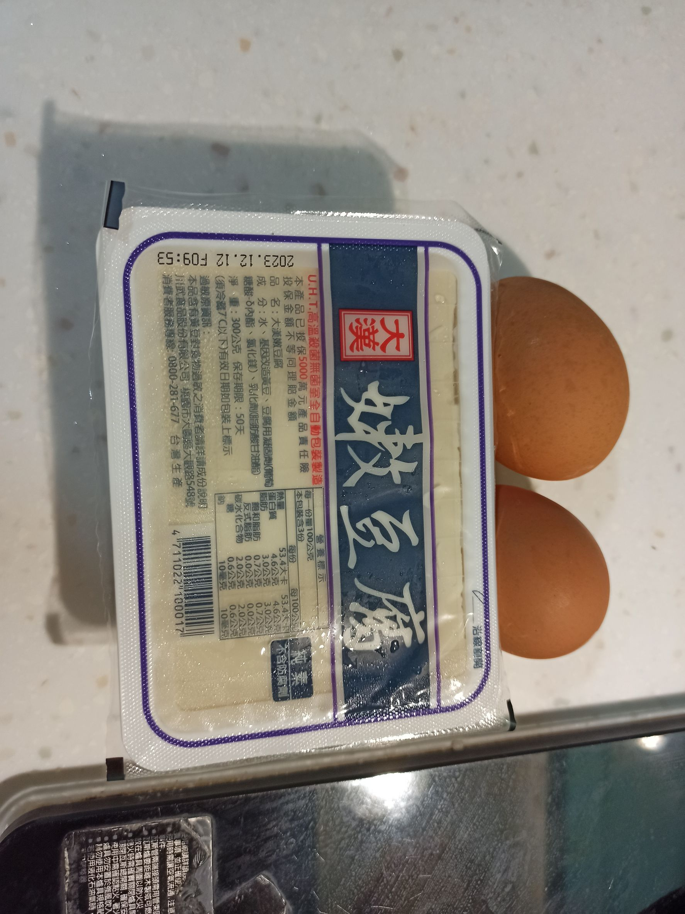
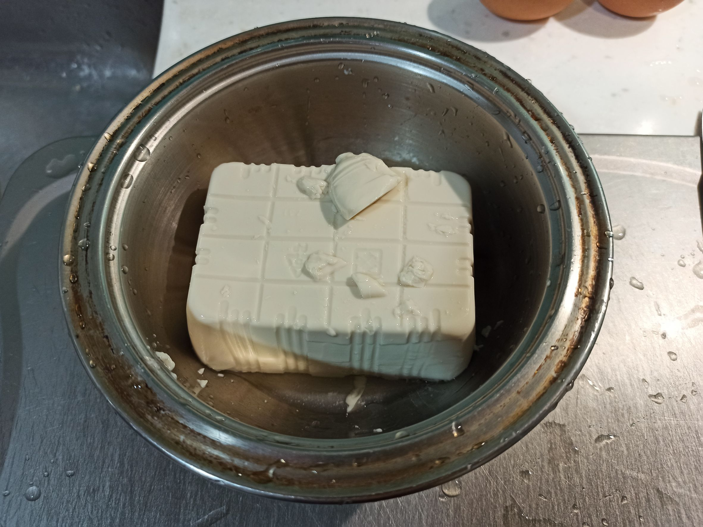
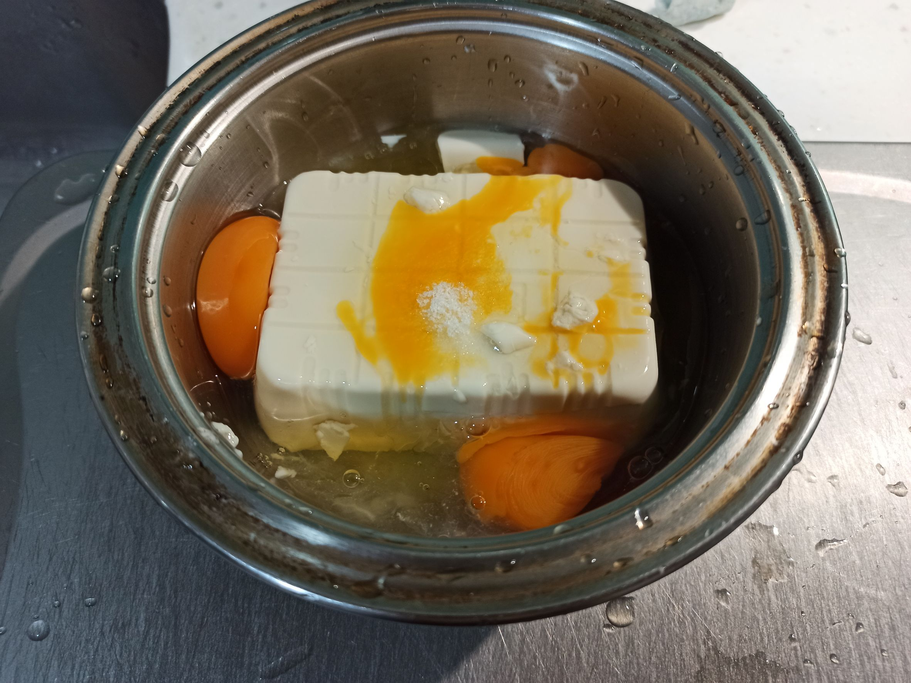
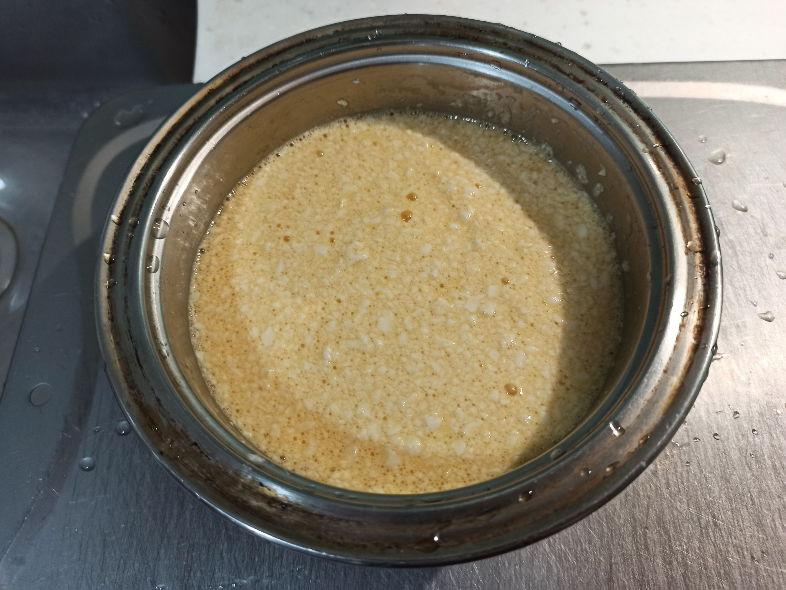
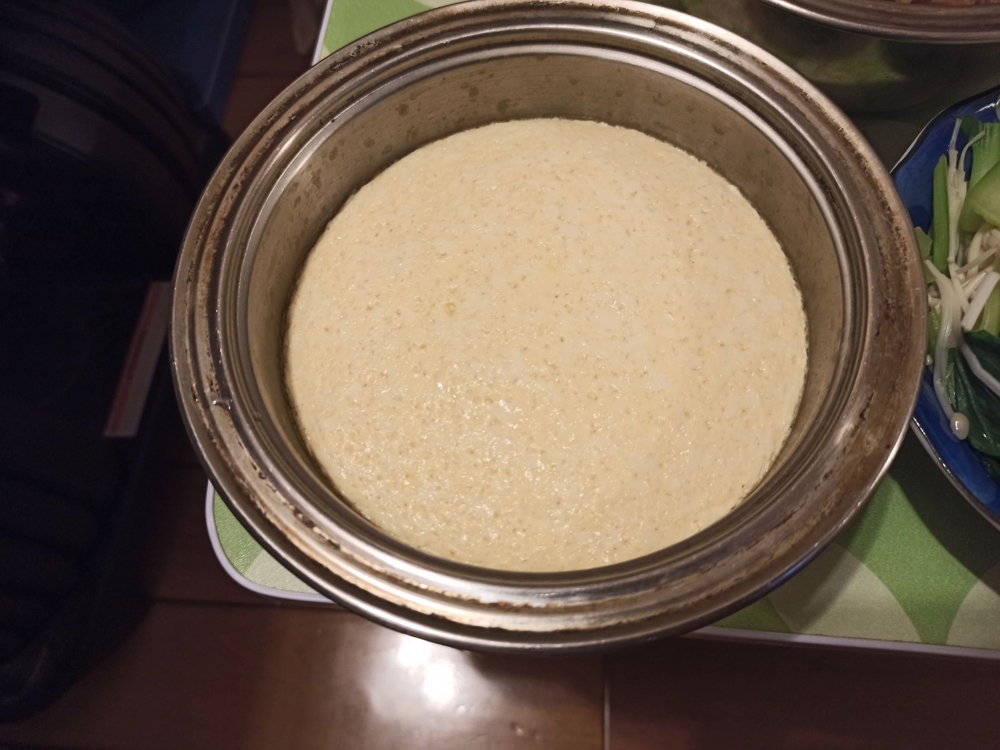

# 雞蛋豆腐
---
+ ## 組成
  1. 雞蛋
  2. 嫩豆腐
  3. 鹽
  4. 香油

+ ## 20231030
  + ### 材料
    1. 雞蛋 2顆
    2. 嫩豆腐 1盒
    3. 鹽 少許
    4. 香油 少許
  
  + ### 作法
    1. 豆腐倒出，把水瀝乾
    2. 兩顆雞蛋打入，加鹽跟香油
    3. 全部攪爛
    4. 電鍋蒸，外鍋至少0.5杯水
  
  + ### 過程與成品
    
    
    
    
    
  
  + ### 檢討
    1. 沒啥好檢討的
  
  + ### 參考資料
    遺失了