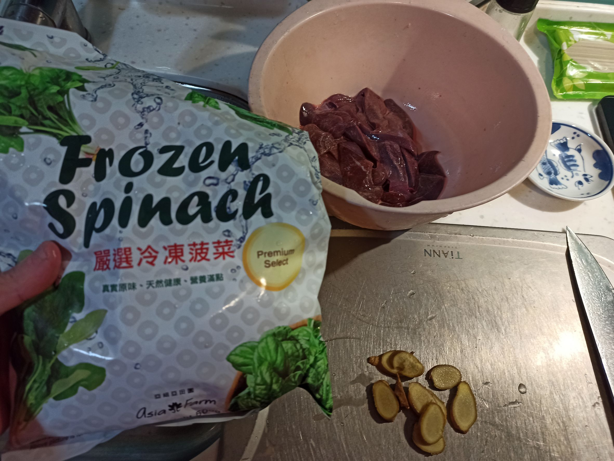
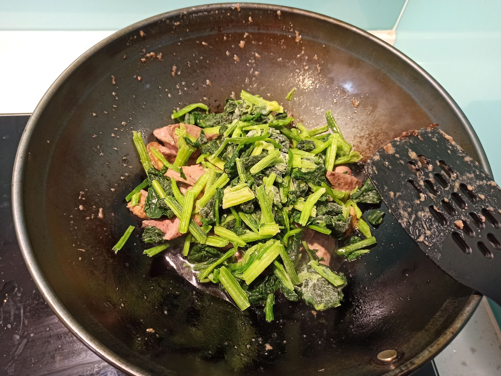
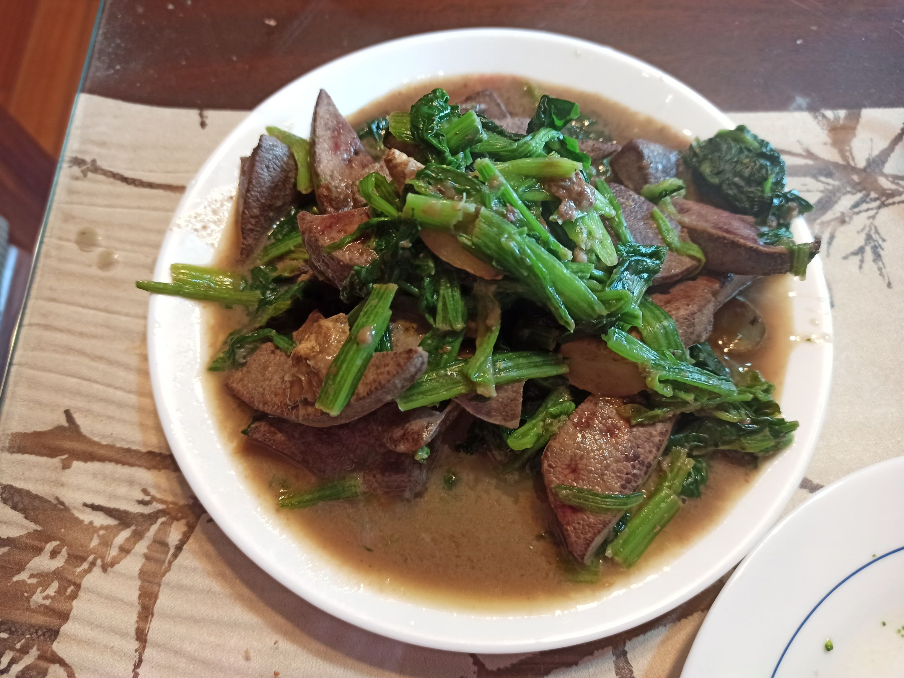

# 麻油豬肝菠菜
---
+ ## 組成
  1. 麻油
  2. 豬肝
  3. 菠菜

+ ## 20221229
  + ### 材料
    1. 麻油 適量
    2. 豬肝 一盒
    3. 菠菜 適量
    4. 鹽  適量
    5. 番薯粉 適量
    6. 薑片  適量
  
  + ### 作法
    1. 洗豬肝，瀝乾，加番薯粉拌一拌
    2. 麻油下熱鍋，薑片下鍋
    3. 豬肝下鍋炒一炒
    4. 菠菜放下去拌炒
    5. 放點水跟鹽起鍋
  
  + ### 過程與成品
    
    
    
  
  + ### 檢討
    1. 水加太多了，以後不要再額外加水了，畢竟是用冷凍菠菜，原本也帶有些水份了，水太多麻油味淡不少
    2. 因為臨時找不到太白粉，用番薯粉代替
    3. 麻油炒薑片，建議冷鍋小火編炒就好，因為麻油起煙點比較低
  
  + ### 參考資料
    [麻油豬肝佐菠菜食譜](https://icook.tw/recipes/327061)