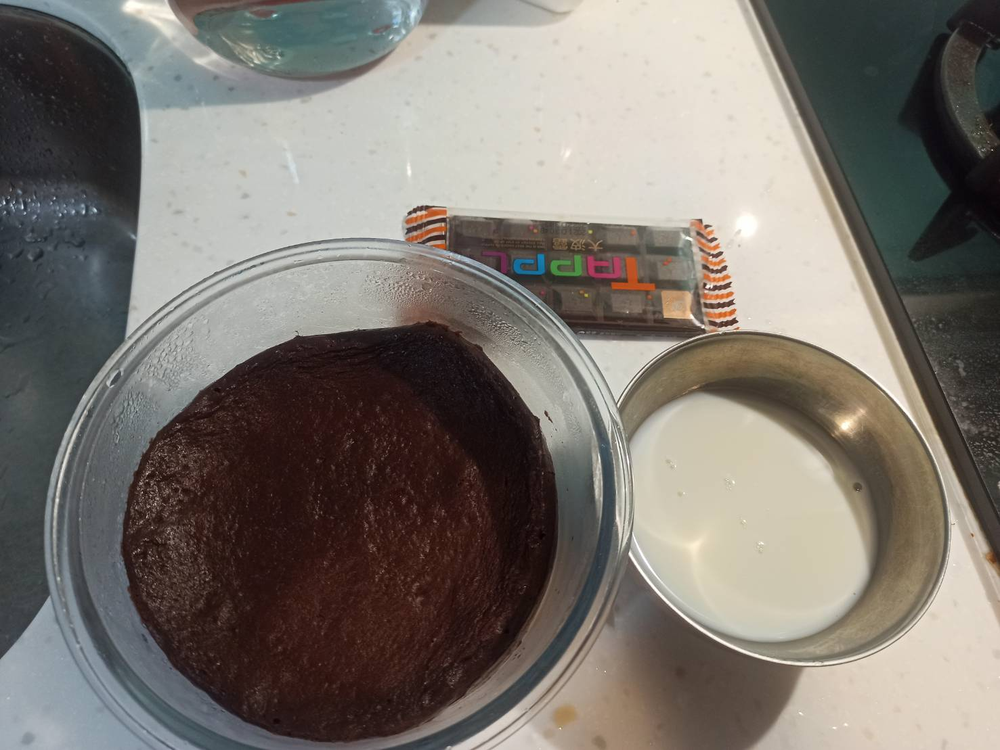
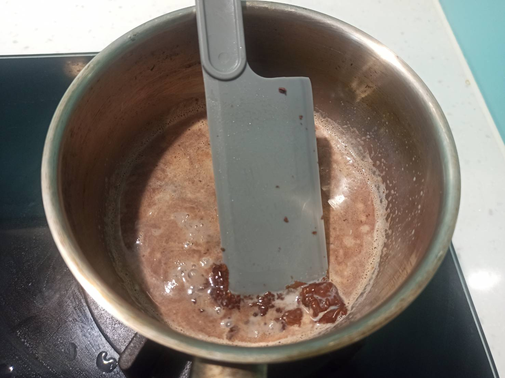
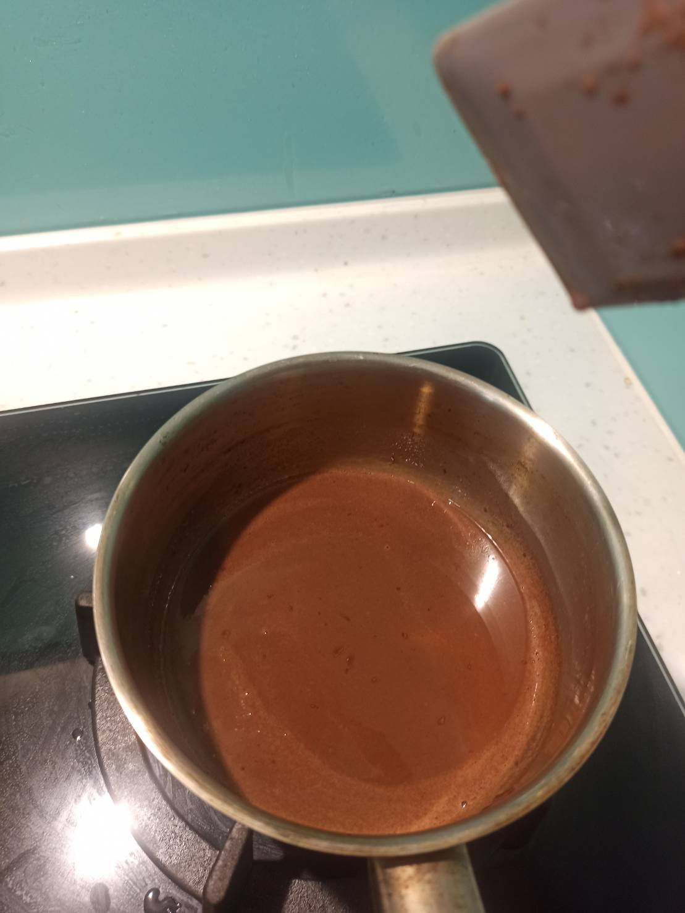
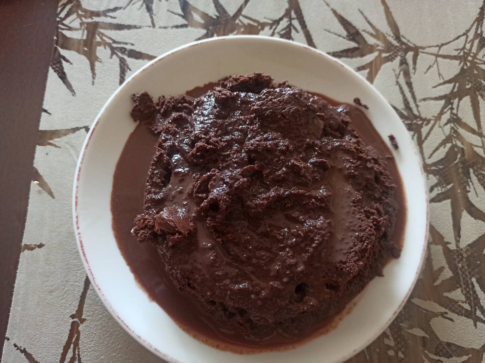

# 香蕉巧克力蛋糕
---

+ ## 20210619
  + ### 材料
    1. 無糖純可可粉 2湯匙
    2. 低糖發酵粉 1湯匙
    3. 一般大條的香蕉 2根
    4. 好吃的雞蛋 2顆
    5. 大波露巧克力 1片
    6. 有貼紙的鮮奶 同材料6種重量

  + ### 作法
    1. 材料3切塊
    2. 材料1~4混在一起用電動攪拌棒攪和成泥狀
    3. 將泥狀物倒入容器裡，保鮮膜包住，蒸10分鐘
    4. 將成品拿去冰等隔天
    5. 將材料5,6丟入鍋子裡，開小火融化
    6. 從冰箱取出成品挖出倒在盤子裡
    7. 融化的巧克力牛奶倒在成品上，完成

  + ### 過程與成品
    
    
    
    

  + ### 檢討
    1. 用大波露巧克力濃化後拌入牛奶太溼了，可能要融完降溫後較好
    2. 蒸後的成品會黏在容器上，下次用烘焙紙或容器塗奶油
    3. 蒸的時候下次不要用保鮮膜改用盤子，應該比較環保
    4. 以後可能試看看烤的玩玩
    5. 份量不多，下次可以試看看2倍量

  + ### 參考資料
    [參考影片](https://youtu.be/EQ5pOxpNtX8)